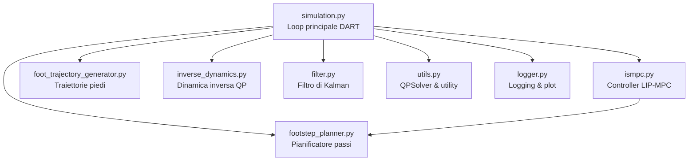
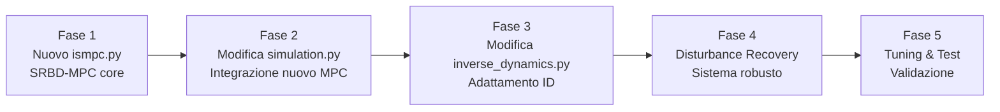

# SRBD-MPC Project — Panoramica e Piano di Sviluppo

## 1. Stato Attuale: il Codebase IS-MPC

Il codice di partenza è l'implementazione IS-MPC del Prof. Scianca. Ecco l'architettura attuale:



### Modello Dinamico Attuale: LIP (Linear Inverted Pendulum)

Il controller attuale in [ismpc.py](file:///home/marco/SRBD-MPC/ismpc/ismpc.py) usa il modello **3D-LIP** (Linear Inverted Pendulum), che tratta il robot come un pendolo con massa puntiforme concentrata nel CoM:

| Proprietà | Valore nel codice |
|---|---|
| **Stato** `x` | 9 variabili: `[x, ẋ, zmp_x, y, ẏ, zmp_y, z, ż, zmp_z]` |
| **Controllo** `u` | 3 variabili: velocità ZMP `[żmp_x, żmp_y, żmp_z]` |
| **Dinamica** | `ẍ_com = η²(x_com - x_zmp)` per ogni asse |
| **Vincoli** | ZMP dentro l'impronta del piede + vincolo di stabilità periodico |

> [!IMPORTANT]
> Il LIP assume **altezza costante del CoM** e **nessuna dinamica di rotazione**. Questo è il limite fondamentale che il SRBD supera.

---

## 2. Cosa Propone il Paper: SRBD-MPC

Il paper **"A Real-Time Approach for Humanoid Robot Walking Including Dynamic Obstacles Avoidance"** propone di passare dal modello LIP al **Single Rigid Body Dynamics (SRBD)**, che modella il robot come un singolo corpo rigido con:

### 2.1 Differenze Fondamentali LIP → SRBD

| Aspetto | LIP (attuale) | SRBD (da implementare) |
|---|---|---|
| **Modello** | Massa puntiforme | Corpo rigido con inerzia |
| **Stato** | Solo CoM pos/vel + ZMP | CoM pos/vel + **orientamento** (quaternioni) + **velocità angolare** |
| **Controllo** | Velocità ZMP | **Forze di reazione al suolo (GRF)** e **momenti** |
| **Dinamica rotazionale** | ❌ Assente | ✅ Equazione di Eulero per il momento angolare |
| **Altezza CoM** | Fissa (parametro `h`) | Variabile (parte dello stato) |
| **Recovery da disturbi** | Limitato | Robusto (grazie alla dinamica completa) |

### 2.2 Equazioni SRBD Fondamentali

Le equazioni che governano l'SRBD sono:

**Dinamica traslazionale:**
```
m · ẍ_com = Σ f_i + m·g
```
dove `f_i` sono le forze di contatto ai piedi e `g` è la gravità.

**Dinamica rotazionale (Equazione di Eulero):**
```
İ·ω + ω × (I·ω) = Σ (r_i - r_com) × f_i
```
dove `I` è il tensore d'inerzia del corpo rigido, `ω` è la velocità angolare, e `r_i` sono i punti di contatto.

**Orientamento con quaternioni** (come nel paper `quaternions.pdf`):
```
q̇ = ½ · q ⊗ [0, ω]
```
dove `q` è il quaternione unitario che rappresenta l'orientamento e `⊗` è il prodotto di quaternioni.

### 2.3 Parti Chiave del Paper per il Progetto

Le sezioni del paper rilevanti per il vostro sviluppo (escludendo obstacle avoidance) sono:

1. **Sezione sul Modello SRBD** — Definizione dello stato e delle equazioni dinamiche
2. **Formulazione MPC** — Funzione costo, vincoli, e orizzonte di predizione
3. **Vincoli di contatto** — Friction cone, wrench constraints, COP limits
4. **Discretizzazione** — Come discretizzare le equazioni continue per l'MPC
5. **Sistema di recovery da disturbi** — Adattamento in tempo reale ai disturbi esterni

---

## 3. Piano di Sviluppo: File per File

### 3.1 `ismpc.py` → SOSTITUZIONE COMPLETA

Questo è il cuore del progetto. Il file attuale va **completamente riscritto** per implementare l'SRBD-MPC.

**Cosa cambia:**

```diff
- Stato:  [x, ẋ, zmp_x, y, ẏ, zmp_y, z, ż, zmp_z]  (9 var)
+ Stato:  [x, y, z, ẋ, ẏ, ż, q0, q1, q2, q3, ωx, ωy, ωz]  (13 var)

- Controllo:  [żmp_x, żmp_y, żmp_z]  (3 var)
+ Controllo:  [fx, fy, fz, τx, τy, τz] per ogni piede  (12 var per 2 contatti)

- Dinamica:  ẍ = η²(x - zmp)  (LIP lineare)
+ Dinamica:  m·ẍ = Σf + mg  &  İω + ω×Iω = Στ  (SRBD nonlineare)

- Vincoli:  ZMP dentro foot_size
+ Vincoli:  Friction cone + COP limits + unilateral contact force
```

**Struttura del nuovo `ismpc.py` (che diventerà `srbd_mpc.py`):**

1. **Definizione stato SRBD** — 13 variabili (pos, vel, quaternione, vel angolare)
2. **Definizione dinamica nonlineare** — Newton-Euler con quaternioni
3. **Formulazione MPC con CasAdi** — QP o NLP a seconda della linearizzazione
4. **Vincoli di contatto** — Friction cone approssimata come piramide
5. **Moving constraints** — Adattamento dal footstep planner
6. **Vincolo di stabilità** — Tail periodico modificato per SRBD
7. **Sistema di disturbance recovery**

### 3.2 `simulation.py` → MODIFICHE

**Modifiche necessarie:**

| Area | Modifica |
|---|---|
| **Inizializzazione MPC** (L88-93) | Istanziare il nuovo `SrbdMpc` invece di `Ismpc` |
| **Stato iniziale** (L111-121) | Aggiungere orientamento (quaternione) e vel. angolare allo stato |
| **Kalman Filter** (L103-121) | Adattare dimensioni: 9 → 13 variabili di stato |
| **Loop principale** `customPreStep` (L127-180) | Aggiornare per gestire il nuovo formato stato SRBD |
| **`retrieve_state`** (L182-250) | Estrarre anche orientamento del corpo e velocità angolare |
| **Parametri** (L19-31) | Aggiungere massa e tensore d'inerzia del robot |
| **Disturbance recovery** | Aggiungere logica per rilevare disturbi e attivare il recovery |

### 3.3 `inverse_dynamics.py` → MODIFICHE

**Modifiche necessarie:**

| Area | Modifica |
|---|---|
| **Task tracking** | Aggiungere tracking dell'orientamento del corpo (dal SRBD) |
| **Vincoli di contatto** | Aggiornare friction cone con le forze calcolate dall'SRBD-MPC |
| **Consistenza GRF** | Assicurare che le forze di contatto dall'MPC siano coerenti con l'inverse dynamics |
| **Gains** | Ri-tarare i guadagni PD per la nuova dinamica |

---

## 4. Come Sfruttare le Informazioni dei Paper

### 4.1 Paper Principale (SRBD-MPC)

| Sezione del Paper | Come usarla nel Progetto |
|---|---|
| Modello SRBD | → Definizione dello stato e delle equazioni in `ismpc.py` |
| Formulazione MPC | → Funzione costo e vincoli in CasAdi |
| Friction cone constraints | → Vincoli nell'ottimizzazione MPC e nell'inverse dynamics |
| Discretizzazione | → Metodo di integrazione (Eulero esplicito come nell'attuale, o RK4) |
| ~~Obstacle avoidance~~ | ~~Non necessario~~ |

### 4.2 Paper Quaternioni

| Concetto | Come usarlo |
|---|---|
| Prodotto quaternioni | → Propagazione orientamento: `q(k+1) = q(k) ⊗ Δq` |
| Quaternione → Matrice rotazione | → Calcolo del tensore d'inerzia nel frame mondo |
| Derivata quaternione | → `q̇ = ½ · q ⊗ [0, ω]` nella dinamica SRBD |
| Normalizzazione | → Vincolo `‖q‖ = 1` nell'MPC |
| Errore di orientamento | → Nella funzione costo dell'MPC |

---

## 5. Roadmap di Sviluppo Suggerita



### Fase 1 — Nuovo `ismpc.py` (SRBD-MPC Core)
1. Definire le variabili di stato SRBD (13 dim)
2. Implementare la dinamica Newton-Euler con quaternioni
3. Formulare il problema MPC in CasAdi (NLP a causa della nonlinearità)
4. Implementare i vincoli di friction cone e COP
5. Adattare il sistema di moving constraints dal footstep planner
6. Testare il solver in isolamento

### Fase 2 — Modifica `simulation.py`
1. Aggiornare i parametri (aggiungere massa, inerzia)
2. Modificare `retrieve_state()` per estrarre orientamento e vel. angolare
3. Sostituire l'istanziazione dell'MPC
4. Aggiornare il Kalman Filter per lo stato esteso
5. Aggiornare il loop principale

### Fase 3 — Modifica `inverse_dynamics.py`
1. Aggiungere task di tracking orientamento
2. Aggiornare i vincoli di contatto per coerenza con l'SRBD-MPC
3. Ritarare i guadagni

### Fase 4 — Sistema di Disturbance Recovery
1. Implementare il rilevamento di disturbi
2. Implementare la logica di recovery (re-planning dei passi, adattamento del CoM)
3. Integrare nell'MPC come vincolo o modifica della funzione costo

### Fase 5 — Tuning e Validazione
1. Tarare i pesi della funzione costo
2. Testare su diversi scenari di cammino
3. Testare la robustezza a disturbi esterni
4. Validare i tempi di calcolo (real-time feasibility)

---

## 6. Aspetti Critici e Decisioni di Design

> [!WARNING]
> ### Linearizzazione vs NLP
> Il LIP attuale è **lineare** → si usa un **QP** (OSQP, velocissimo).
> L'SRBD è **nonlineare** → si può:
> - **(a)** Linearizzare attorno alla traiettoria nominale → QP sequenziale (SQP) — più veloce, meno accurato
> - **(b)** Risolvere un NLP completo con CasAdi + IPOPT — più accurato, più lento
>
> La scelta dipende dai requisiti di real-time. Il paper probabilmente usa l'approccio (a).

> [!NOTE]
> ### File che NON cambiano
> - `footstep_planner.py` — Resta invariato, genera la sequenza di passi
> - `foot_trajectory_generator.py` — Resta invariato, genera le traiettorie dei piedi
> - `filter.py` — La struttura resta, ma le dimensioni dello stato cambiano
> - `utils.py` — Potrebbe servire aggiungere funzioni per quaternioni
> - `logger.py` — Potrebbe servire aggiungere log per le nuove variabili
